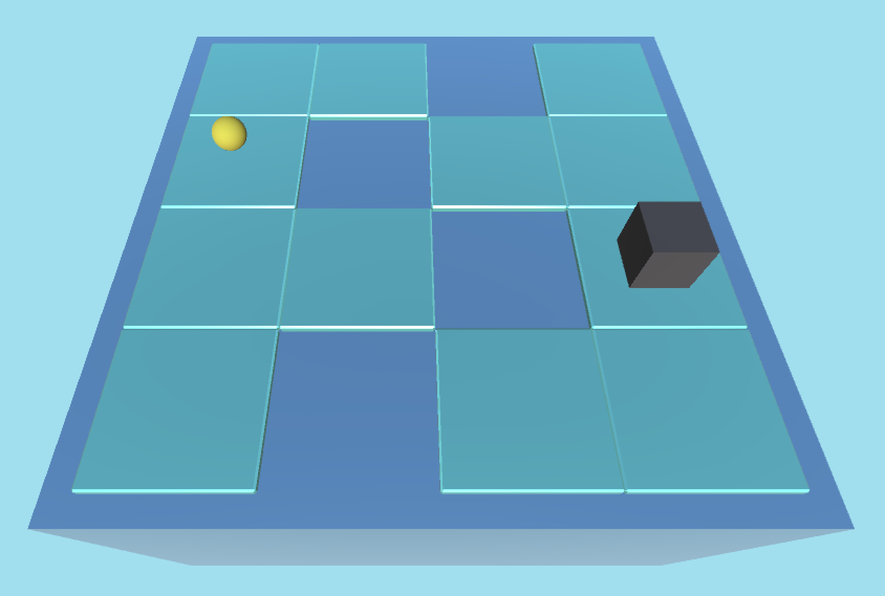

## Frozen lake :snowflake:

Frozen lake is a Unity Environment created for training reinforcement learning agents.
The goal of the agent (cube) is to reach its target (sphere) and not to drown while doing it. 
The implementation was inspired by OpenAI's gym.

### Features

:white_check_mark: Can be used with both Unity ML-Agents Trainer and its python low level API directly\
:white_check_mark: A prefab was created from the environment which allows it to be duplicated for faster training\
:white_check_mark: Random positions of the agent, its target and holes in the ice to prevent the agent from learning wrong patterns 



### Environment description
The environment is a for `4 by 4` grid where the agent uses continuous actions to move.
Positions of the agent and its target are set randomly at the begging of each episode.
Holes in the ice are set randomly across the hole grid except positions occupied by the agent and its target.

As `observations` the agent receives and array of `20` floats.\
The first four are `X` and `Z` coordinates of the agent itself and the target.
The rest is a one-hot vector of holes in the ices states (0. for `not a hole` and 1. for `hole`).

The `action space` represents an array of 2 floats. One for each direction (X and Z axis)

The agent will receive a `reward` of 1 once reached the target and a reward of -1 when falling in a hole or from the edge of the grid.
It will also continuously get a bit of negative reward to prevent it from doing nothing.

### Installation
1. Install Unity editor. Compatible version is 2021.3.25f1
2. Install ML-agents package version 2.2.1-exp.1 using Package Manager
3. Install requirements
```
    python -m venv env
    source env/bin/activate
    pip install --upgrade pip
    pip install -r requirements.txt
```

### Usage
Run the following command to start training an agent:

`mlagents-learn config/MoveToGoal.yaml --run-id=test_run`

You can use behavioral cloning to speed up the training process. To do that add the `Demonstration Recorder`
component to you agent, check `record` and play for some time. Then uncomment `behavioral_clonning` parameters in the config file
and train.